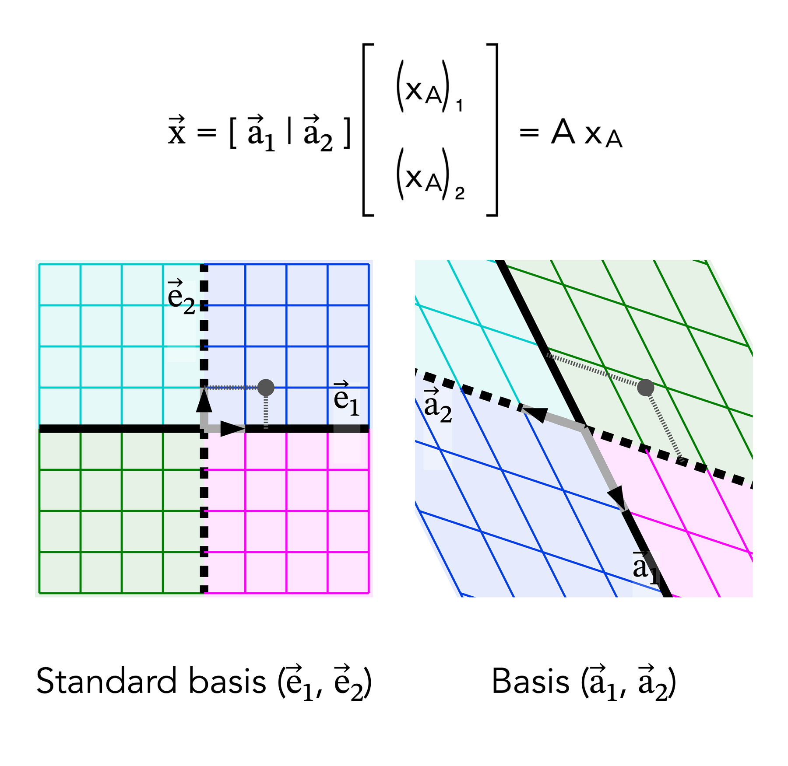
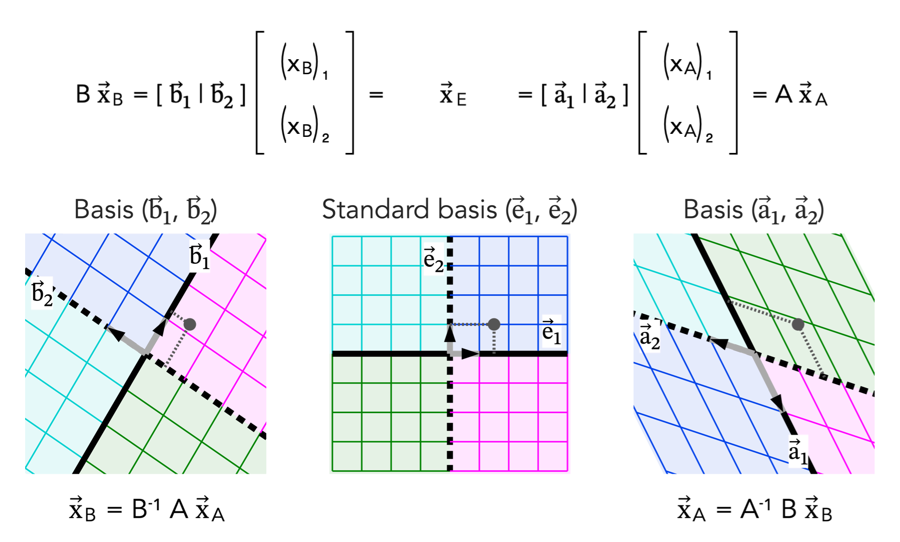

# Change of Basis — Coordinate Mapping View

Change of basis describes how the same geometric vector can be represented using different coordinate systems. The vector itself does not change; only its coordinate representation changes relative to the chosen basis.

## Key Insight
This representation separates basis reconstruction from coordinate transformation explicitly.

## Visual

## Structure

- A basis matrix reconstructs a vector from coordinates  
- Coordinates depend on the chosen basis  
- Same vector: x = A x_A = B x_B  
- Coordinate transformation: x_B = B⁻¹ A x_A  

## Reference (Web)
https://www.graphmath.com/la/concepts/change-of-basis-coordinate-mapping.html

## Attribution
GraphMath — Linear Algebra
