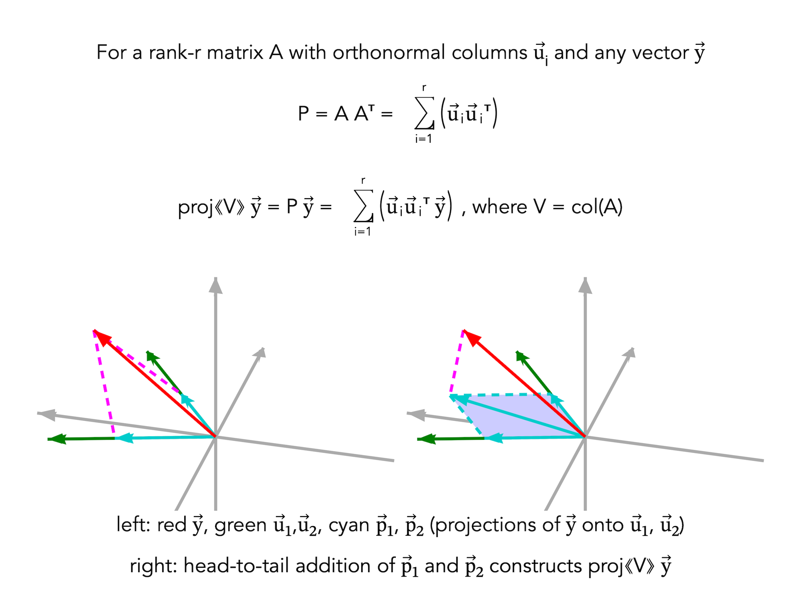

# Least Squares as Projection in R³ (3 Observations, 2 Parameters)

Least squares in this setting can be interpreted as an orthogonal projection of a data vector onto the column space of a design matrix. For three observations and two parameters, the column space forms a plane in R³, and the fitted vector is the closest point on that plane to the observed data.

## Key Insight
This representation separates the data space from the model subspace, making the projection structure explicit.

## Visual

## Structure

- Data vector lives in R³  
- Model subspace is col(X) (a plane)  
- Solution is orthogonal projection onto col(X)  
- Residual is perpendicular to the subspace  

## Reference (Web)
https://www.graphmath.com/la/concepts/least-squares-projection-r3.html

## Attribution
GraphMath — Linear Algebra
